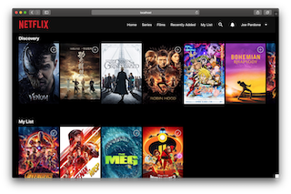
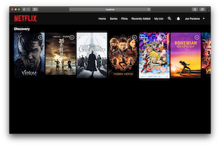

# netflix-react-redux-styling-fun

This projects attemps to style the look and a small part of the functionality of Netflix!

I built it to learn key React and Redux concepts such as using JSX to produce React elements, understanding how one-way data flow works with nested components, as well as practicing my styling skills and interacting with external APIs! I think it was the first time I used Javascript's ```fetch``` API!

## Screenshots

<p align="center">
  
  
</p>

## Getting started

If you would like to run the code yourself, simply clone the repo, run ```npm install``` and then ```npm start```.

